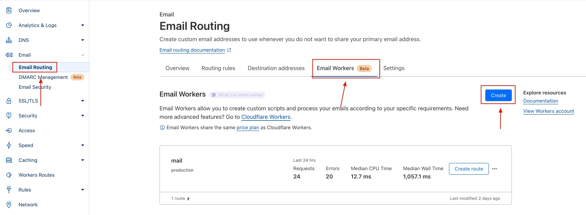

# 🧰 自建部署教程 (v2.0.0+)

## 邮件接收原理

使用 Cloudflare 的邮件转发功能，将接收到的所有邮件通过 Workers 转发到本程序中。

**所以自建的邮箱域名必须使用 Cloudflare 进行 DNS 解析**

## 开启邮件转发 & 创建 Workers

- 首先开启邮件转发，按照官方流程来就行

- 创建一个 Workers，模板随便选都可以



创建好之后点击`Code editor`编辑代码，将[此处](doc/workers.js)的代码粘贴进去，需要将其中的域名`mail.sunls.de`替换为自己的，然后别忘记点击`Save and deploy`部署:


- 然后需要添加一条`Catch-All`的规则，注意要选择`Send to a Worker`，如图:


## 环境变量配置

### TODO: 数据库配置

### 必须
- `DOMAIN_LIST`: 支持的域名列表，使用`,`分割，例如: `isco.eu.org|chato.eu.org`

### 非必须
- `HOST`: 服务监听地址，默认为`127.0.0.1`
- `PORT`: 服务监听端口，默认为`3000`

### 统计
- `UMAMI_ID`: Umami 统计的 website-id
- `UMAMI_URL`: Umami 统计的 script.js 地址
- `UMAMI_DOMAINS`: Umami 统计只在特定域名运行，逗号分割

## 部署

_请修改其中的环境变量配置_

### Docker

```shell
docker run --name mail -d --restart unless-stopped -e 'HOSTNAME=0.0.0.0' -e 'DOMAIN_LIST=isco.eu.org|chato.eu.org' -p 3000:3000 sunls24/tmail
```

### Docker Compose & Caddy (推荐)

_如果不需要反向代理，需要设置`HOST=0.0.0.0`环境变量_

**docker-compose.yaml**

```yaml
version: "3.0"

services:
  mail:
    container_name: mail
    image: sunls24/tmail:latest
    network_mode: host
    restart: unless-stopped
    environment:
      - "DOMAIN_LIST=isco.eu.org|chato.eu.org"
```

**Caddyfile**

```text
mail.example.com {
    reverse_proxy 127.0.0.1:3000
}
```
